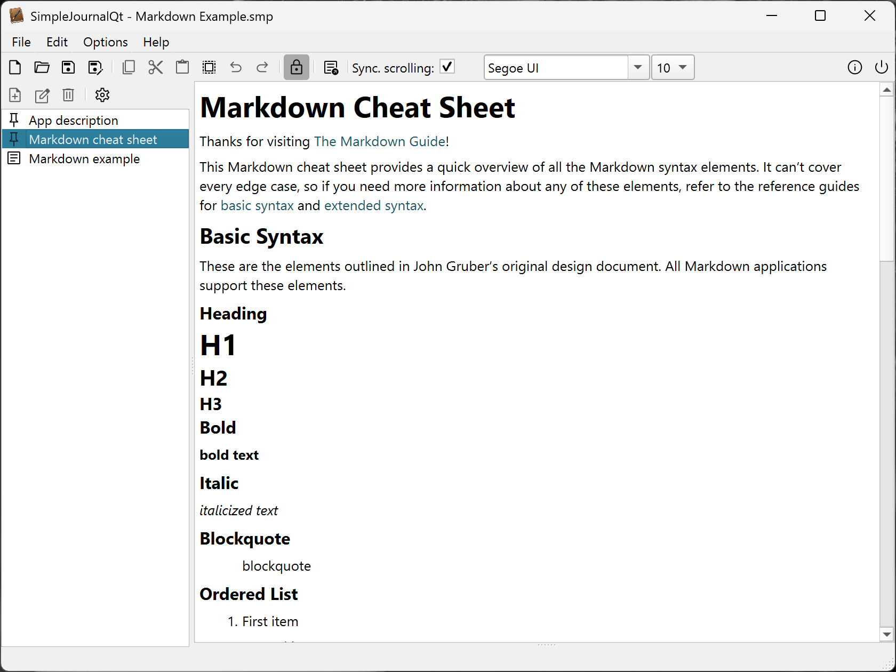
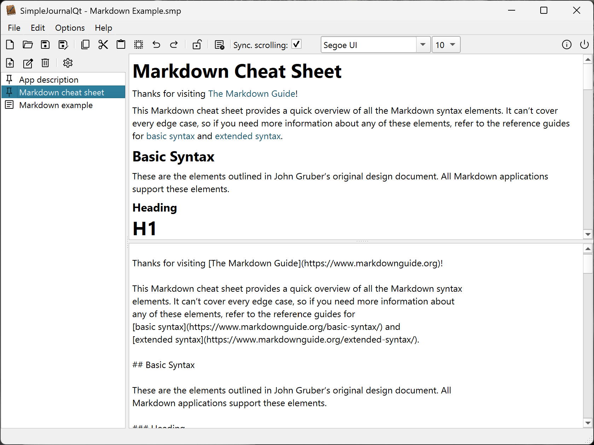
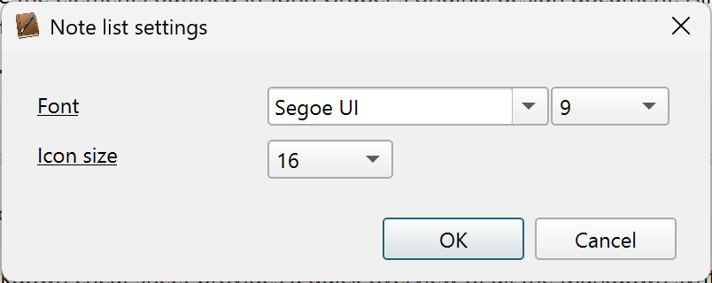
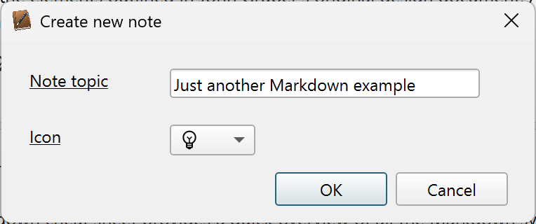
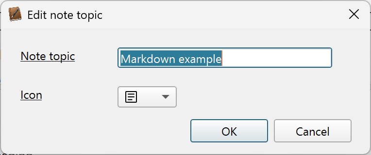

## SimpleJournalQt (w) 2025 Jan Buchholz

**SimpleJournalQt** is a lightweight, journal-style application designed for
organizing and editing notes with Markdown support:

- On the left side, users can create and manage a list of notes (topics).
- On the right side, a combined Markdown Viewer and Editor provides both
  reading and editing capabilities.
- Upon startup, most functions are disabled until a new note is created,
  ensuring a clear workflow.
- Each note can be assigned one of 15 available icons, with global
  configuration options for icon size and list font style.
- The interface is toggleable between View and Edit modes:
- In View mode, the editor is hidden, offering a clean reading experience.
- In Edit mode, scrolling between the editor and viewer can be synchronized for
  seamless navigation.

#### View mode

#### Edit mode

#### Settings

#### Create note (topic)

#### Edit note (topic)

***You can use the following icons to categorize your notes:***

         

    

### Credits
[Special thanks to Martin Mitáš (mity) and all contributors to the md4c library.](https://github.com/mity/md4c)

### Updates

**2026-04-05:**
- Fixed YesNoCancel dialog
- Fixed delete last remaining note logic

**2026-04-07:**
- Added MD_FLAG_HARD_SOFT_BREAK to md4c flags
- Made highlighting more tolerant

**2026-04-09:**
- macOS UI fixes only:
- added splitter handle stylesheets to splitters to reduce handle with
- explicitly set handle width to zero in viewer only mode since hiding the handle completely failed

**2026-04-10:**
- Completely redesigned the logic to keep editor and viewer in sync
